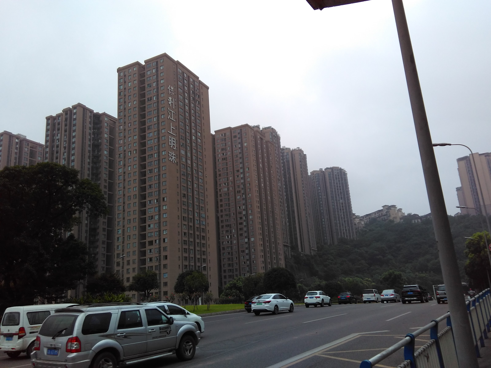

# This is Cong's awesome website

What if I add some text here...?


## Here's a subsection

And here's some additional text ...

```{r}
rnorm(10)
```

# Links to other websites

Let's link to useful tools for data science:

* [Google](https://www.google.com)
* [P8105](https://p8105.com)

# Local image

Here's my apartment, Baoli Jiangshang Mingzhu:



# Link to page within the site

[About me](about.html)


## Quarterly Results {.tabset}

### By Product

This is my first tab and i can do stuff

### By Region

This is my second tab and it does other stuff

# This is a new section

It's really great
